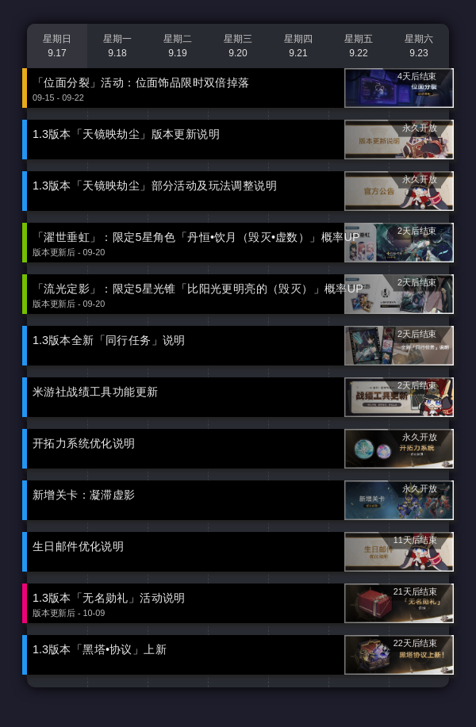

# 《崩坏：星穹铁道》活动日历

## 安装

通过 `nb`或 `pip` 命令安装插件

`pip install nonebot_plugin_star_rail_calendar`
 或 
`nb plugin install nonebot_plugin_star_rail_calendar`

## 命令

`<星穹/星琼>日历` 查看本群订阅服务器日历 
`<星穹/星琼>日历 on/off` 订阅/取消指定服务器的日历推送 
`<星穹/星琼>日历 time 时:分`  设置原神日历推送时间 
`<星穹/星琼>日历 status`  查看原神日历推送设置

### 功能演示

